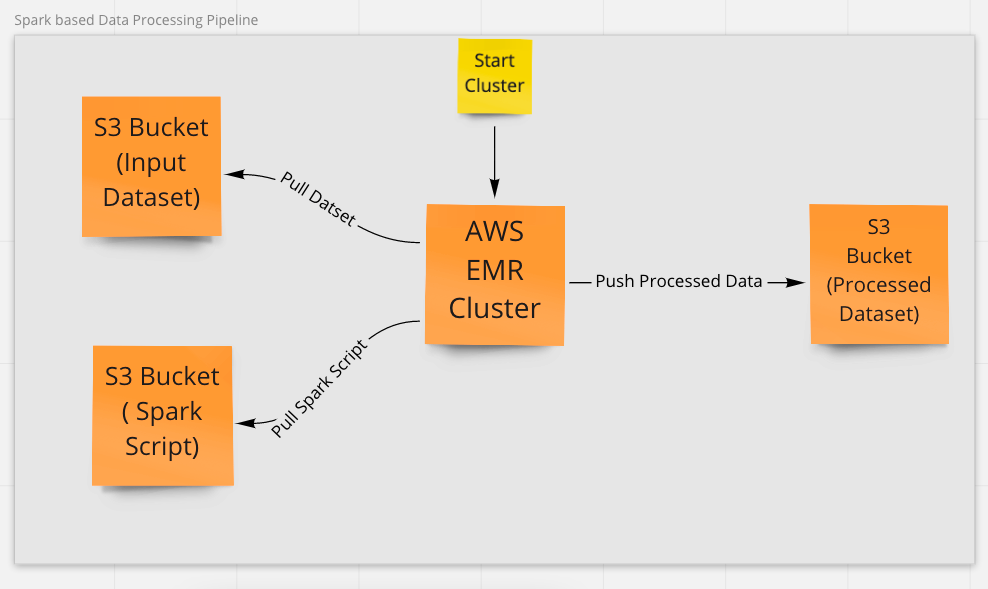

# Spark_Data_poecessing_pipeline
  The pipeline processes the data in the AWS EMR cluster with Spark.
 
 

In this pipeline, I created a Spark-based Transient AWS EMR cluster. The cluster performs the 3 steps. Check the custom JAR script.

1. EMR cluster pulls the sparkProcessingScript.py script. 
2. The cluster read the data from s3 bucket (users_app_big_dataset.csv) and perform all the processing task on it.
3. After processing, save the processed data in the S3 Bucket as parquet file.

If you want to play locally without EMR cluster, check sparkProcessingScript.ipynb notebook. You need spark installed in your machine.
